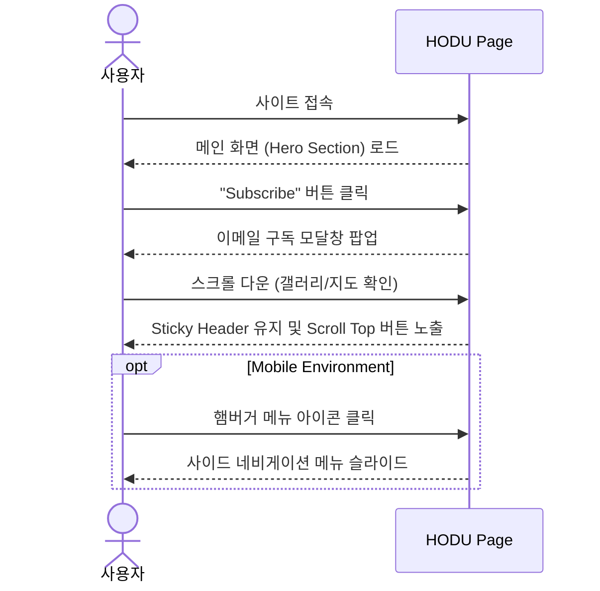

# 🐱 HODU - 고양이 집사를 위한 랜딩 페이지

## 1. 프로젝트 개요

### 1.1 목표
- **웹 표준을 준수한 시맨틱 마크업**: HTML5 시맨틱 태그를 활용하여 구조적이고 접근성 높은 웹 페이지 구현
- **반응형 웹 디자인(RWD)**: 데스크탑, 태블릿, 모바일 등 다양한 디바이스 환경에 최적화된 레이아웃 제공
- **Figma 디자인 구현**: 제공된 디자인 시안을 오차 없이 정교하게 퍼블리싱하는 능력 배양
- **순수 CSS 활용**: 별도의 프레임워크(Bootstrap 등) 없이 Flexbox와 Grid를 활용한 레이아웃 설계

### 1.2 주요 기능
- **반응형 레이아웃**: 
  - Desktop (1280px 이상)
  - Tablet (1280px 이하)
  - Mobile (768px 이하)
- **모달(Modal) 인터페이스**: 구독 버튼 클릭 시 팝업 및 모바일 메뉴 구현 (HTML/CSS 기반 구조)
- **이미지 갤러리**: CSS Grid를 활용한 3열 카드 레이아웃
- **Scroll Top**: 페이지 최상단으로 이동하는 고정 버튼 배치
- **네비게이션**: 스크롤 시 상단에 고정되는 Sticky Header 구현

### 1.3 팀 구성 & 개발 기간
- **개발 기간**: 2025.12.11 ~ 2025.12.18 (7일)
- **팀 구성**: 1인 개발 (Personal Project)

<table>
  <tr>
    <th align="center">Name</th>
    <th align="center">Role</th>
    <th align="center">Github</th>
  </tr>
  <tr>
    <td align="center"><strong>본인 이름</strong></td>
    <td align="center">Frontend Developer<br>(Publishing)</td>
    <td align="center">
        <a href="https://github.com/magnesium03">
            
        </a>
    </td>
  </tr>
</table>

## 2. 개발 환경 및 배포 URL

### 2.1 기술 스택
- **Language**: HTML5, CSS3
- **Editor**: Visual Studio Code
- **Versioning**: Git, GitHub
- **Deploy**: GitHub Pages

### 2.2 배포 URL
- **Live Demo**: [https://magnesium03.github.io/first_mini_project2/](https://magnesium03.github.io/first_mini_project2/)
- **Design Source**: [Figma Link](https://www.figma.com/design/rbi8px4O2GrnXN4gK0ZaLv/WENIV_FE_%EC%8B%A4%EC%8A%B5-%EC%98%88%EC%A0%9C?node-id=49-1791&p=f&t=NlVsrGvdZ10glS7b-0)

## 3. 프로젝트 구조

### 3.1 폴더 트리
📦first_mini_project2
 ┣ 📂img                # 프로젝트 이미지 리소스 폴더
 ┃ ┣ 📜logo.svg
 ┃ ┣ 📜icon-blog.svg
 ┃ ┗ ... (기타 이미지)
 ┣ 📜index.html         # 메인 페이지 구조 (Semantic Markup)
 ┣ 📜style.css          # 메인 스타일 (Layout, Component, Media Query)
 ┣ 📜reset.css          # 스타일 초기화 & 폰트 설정 (Spoqa Han Sans Neo)
 ┗ 📜README.md          # 프로젝트 설명 문서

### 3.2 사용자 흐름 (User Flow)


## 4. UI/UX 및 구현 화면

## 4.1 와이어프레임 및 디자인피그마(Figma)
- 디자인 시안을 바탕으로 픽셀 퍼펙트(Pixel Perfect)를 지향하며 개발하였습니다.
- Main Color: #F2E9D8 (Beige), #D97652 (Orange)
- Font: Spoqa Han Sans Neo

## 4.2 화면 설계
Desktop ViewMobile View
(※ 실제 구현된 화면을 캡쳐하여 img 폴더에 넣고 경로를 수정해주세요)

## 5. 주요 코드 및 트러블 슈팅

### 5.1 반응형 미디어 쿼리 전략
- 다양한 기기 대응을 위해 Breakpoint를 1280px, 768px로 설정하여 레이아웃을 조정했습니다.

```CSS
/* Tablet & Small Desktop */
@media (max-width: 1280px) {
    header .container_navigation-bar {
        width: 100%;
        padding: 0 20px;
    }
    /* 그리드 레이아웃 유연화 */
    main .section-container .card-grid {
        gap: 20px;
    }
}

/* Mobile */
@media (max-width: 768px) {
    /* 3단 그리드를 1단으로 변경 */
    main .section-container .card-grid {
        grid-template-columns: 1fr;
    }
    /* 네비게이션 숨김 및 햄버거 메뉴 노출 */
    header nav { display: none; }
    header .menu { display: block; }
}
```

### 5.2 CSS 변수(Variables) 활용
- 유지보수 효율성을 높이기 위해 색상 코드를 :root 변수로 관리했습니다.

```CSS
:root {
    --bg-color: #F2E9D8;
    --btn-color: #D97652;
    --sub-color: #263140;
    --shadow: rgba(0, 0, 0, 0.25);
}
```

## 6. 개발 회고 및 느낀점

### 6.1 배운 점
- 시맨틱 태그의 중요성: div 남발을 줄이고 header, main, section, footer 등을 사용하여 문서 구조를 명확히 잡는 법을 익혔습니다.
- Grid & Flexbox: 복잡한 배치는 Grid로, 1차원 배치는 Flexbox로 상황에 맞게 CSS 레이아웃 시스템을 선택하여 적용했습니다.
- 크로스 브라우징: reset.css를 통해 브라우저 간 기본 스타일 차이를 최소화하는 경험을 했습니다.

### 6.2 향후 개선 사항
- JavaScript 기능 추가: 현재는 UI만 구현되어 있는 모달창 닫기 기능, 이메일 유효성 검사, 스크롤 탑 버튼 동작 등을 JavaScript로 구현하여 동적인 웹사이트로 발전시킬 예정입니다.
- 이미지 최적화: 고해상도 이미지가 많아 로딩 속도 개선을 위해 picture 태그나 WebP 포맷 도입을 고려하고 있습니다.